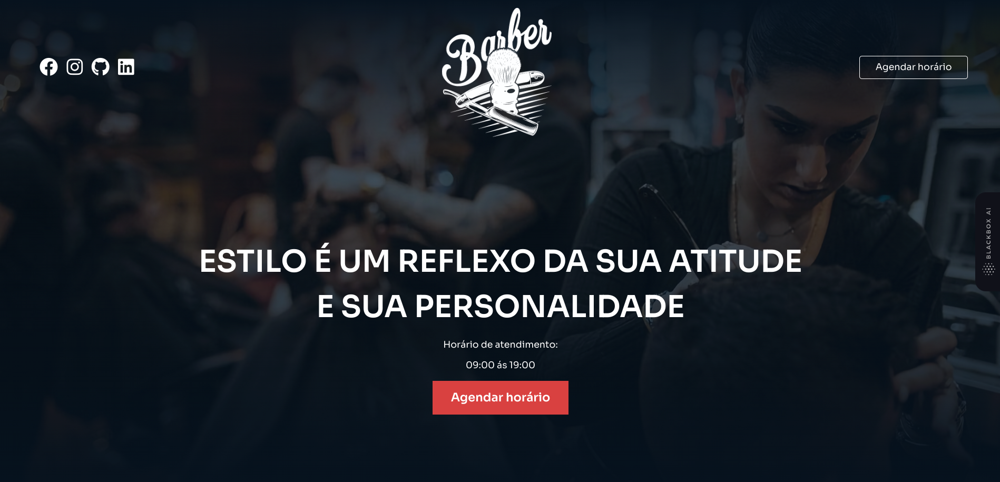
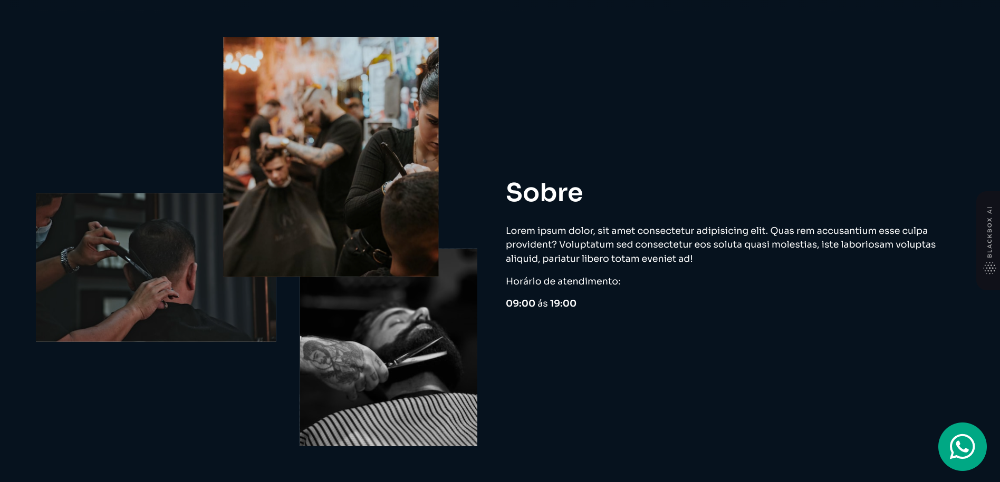
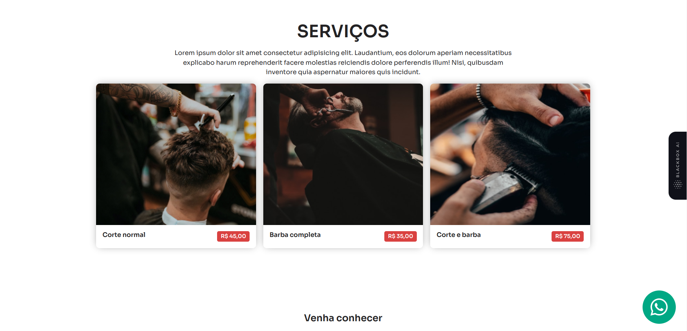
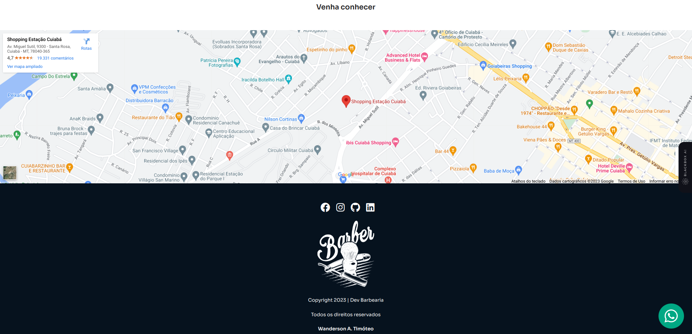
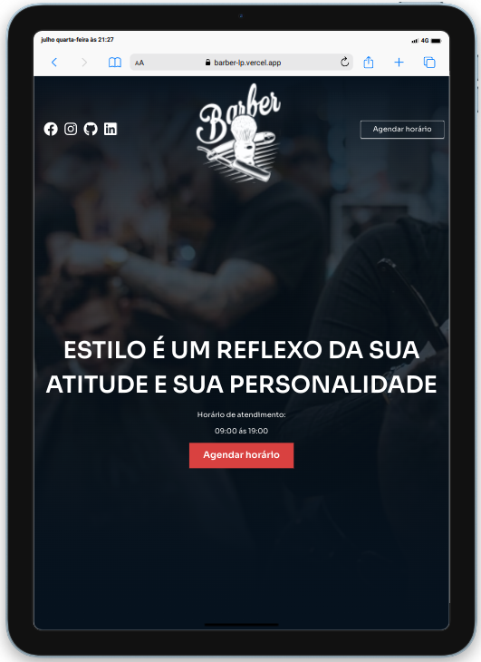
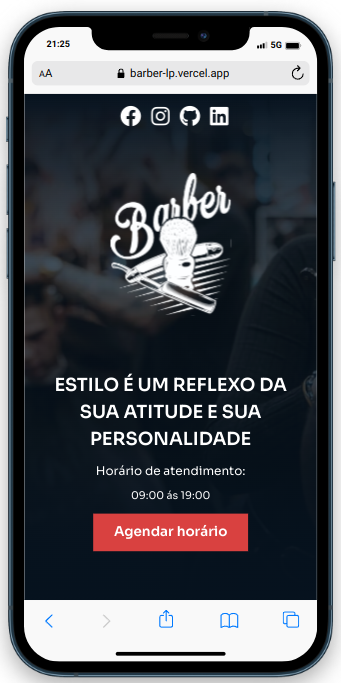
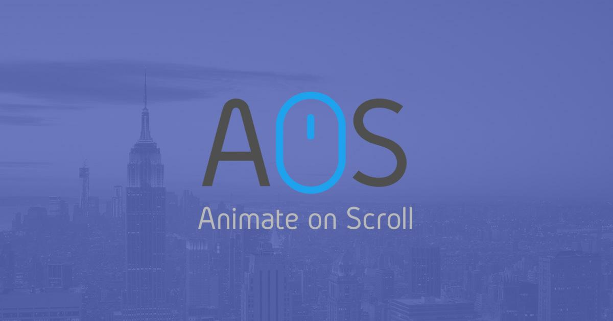

<h1 align="center">
  
  <span style= color:#06121E> Dev Barber </span>
</h1>

<div align="center">
  <a href="#-projeto">Projeto</a>&nbsp;&nbsp;&nbsp;|&nbsp;&nbsp;&nbsp;
  <a href="#-tecnologias">Tecnologias</a>&nbsp;&nbsp;&nbsp;|&nbsp;&nbsp;&nbsp;
  <a href="#-licença">Licença</a>&nbsp;&nbsp;&nbsp;|&nbsp;&nbsp;&nbsp;
  <a href="#-autor">Autor</a>
</div>

<br>

<p align="center">
  
  
  
</p>

<br>

## 💻 Projeto

Este projeto consiste em uma landing page desenvolvida para treinar e para aprimorar meus conhecimentos em HTML5, CSS3, Javascript, Sass e Animações com a biblioteca AOS.

#### Acessar Site Dev Barber

**[Clique aqui](https://barber-lp-wanderson-a-timoteo.vercel.app/)**

<br>

### Seção Home

<p align="center">
    
</p>
<br>

### Seção Sobre

<p align="center">
    
</p>
<br>

### Seção de Serviços

<p align="center">
    
</p>
<br>

### Seção Mapa de Localização e Fotter

<p align="center">
    
</p>
<br>

### Tablet

<p align="center">
    
</p>
<br>

### Smartphone

<p align="center">
    
</p>
<br>

## 🚀 Tecnologias

Esse projeto foi desenvolvido com as seguintes tecnologias e ferramentas:

<div align="center">
  
  
  
  
  
  

</div>

<br>

## 🔥 Executar Aplicação

### 🎇 Executando Localmente a Aplicação

Caso você deseja executar o projeto na sua máquina local, você precisará clonar o projeto, para isso, basta seguir os passos abaixo:

### 🌀 Começando...

Para começar, você deve simplesmente clonar o repositório do projeto na sua máquina.

Navegue até o local onde você clonou o projeto, exemplo:

```sh
C:\Users\NomeDoComputador\Documents\CloneDoProjeto
```

### 🛰️ Executando o projeto

Para executar sugiro que abra o projeto com a IDE VSCode.
Se estiver usando o VSCode é só instalar a extensão Live Sass Compiler e Clicar em Watch Sass que fica no rodapé da IDE para iniciar a compilação.

Agora é só executar o arquivo index.html com a extensão Live Server, clique com botão esquerdo do mouse e execute Open with Live Server.

Pronto! dessa forma o projeto `barber-lp` estará rodando localmente em sua maquina. Acesse no navegador o endereço abaixo:

```
http://127.0.0.1:5500/index.html
```

<br>

## 🚩 Tenho Dúvidas... O que fazer?

Caso tenha dúvidas sobre o código do projeto, sintam-se a vontade em abrir uma **[ISSUE AQUI](https://github.com/Wanderson-A-Timoteo/barber-lp/issues)**. Assim que possível, responderei todas as dúvidas!

<br>

## 💡 Licença

Esse projeto está sob a licença MIT. Veja o arquivo [LICENSE](.github/LICENSE.md) para mais detalhes.

<br>

## 🎆 Autor

Feito com ♥ by

<div align='center'>

[<br><sub>Wanderson A. Timóteo</sub>](https://www.wandersontimoteo.ga/)

</div>

<br>

## 🤝 Agradecimentos

<p align="center">
    
</p>
<br>

Projeto desenvolvido assistindo a vídeo aula no YouTube, canal do [Sujeito Programador](https://www.youtube.com/@Sujeitoprogramador).

Agradecimento ao [Matheus Fraga](https://sujeitoprogramador.com/fullstackpro/) por compartilhar conteúdo relevante e com qualidade de ensino.
